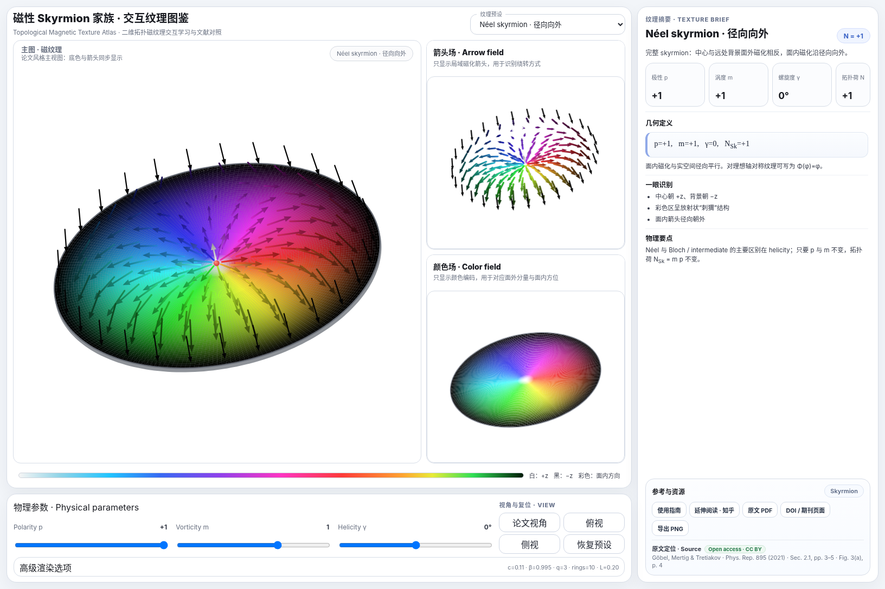
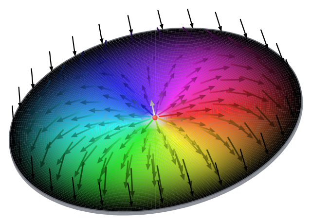
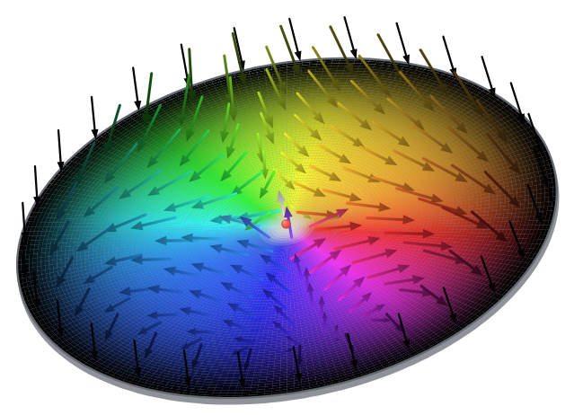
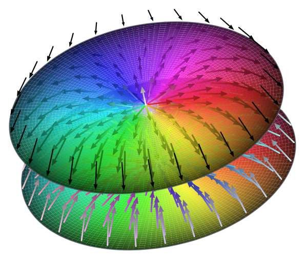

# Topological Magnetic Texture Atlas

**磁性 Skyrmion 家族 · 交互纹理图鉴**

面向磁性拓扑纹理学习与科研交流的单页交互可视化工具。

**[🌐 在线体验](https://xin-jiaqi.github.io/skyrmion-texture-atlas/) · [📖 中文综述](https://zhuanlan.zhihu.com/p/2069027257536999823) · [📘 使用指南](docs/guide.md)**

> Desktop optimized；手机端已提供单栏布局，复杂纹理仍推荐桌面访问。

| Néel skyrmion | Antiskyrmion | AFM skyrmion |
|---|---|---|
|  |  |  |

## 功能

- 13 个二维磁性拓扑纹理预设：
  - Néel skyrmion：径向向外 / 径向向内
  - Bloch skyrmion：CW / CCW
  - intermediate-helicity skyrmion
  - higher-order skyrmion，`m = 2`
  - antiskyrmion
  - skyrmionium
  - biskyrmion
  - meron
  - bimeron
  - antiferromagnetic skyrmion
  - ferrimagnetic skyrmion
- 同步显示：
  - 主磁纹理
  - Arrow field
  - Color field
- 对适用预设直接调节 `p`、`m`、`γ`
- 对 bimeron、biskyrmion、skyrmionium、AFM / FiM skyrmion 自动锁定不适用的全局参数
- 论文视角、俯视、侧视、拖动旋转、缩放和平移
- 一键导出当前主图 PNG
- 内置几何定义、识别要点、物理解释与原文 Fig. / Sec. / page 定位
- 可离线运行，无前端框架依赖

## 科学表示说明

对于完整、近似轴对称的二维 ferromagnetic skyrmion，可写为

$$
\mathbf m(\mathbf r)=
\begin{pmatrix}
\sin\theta\cos\Phi\\
\sin\theta\sin\Phi\\
\cos\theta
\end{pmatrix},
$$

并用

$$
\Phi(\phi)=m\phi+\gamma
$$

描述面内绕转。对这类纹理，程序使用

$$
N_{\mathrm{Sk}}=mp
$$

帮助理解 polarity、vorticity 与拓扑荷的关系。

复合纹理和多子晶格纹理需要扩展描述。网页对这些对象采取以下教学表示：

- **Biskyrmion / Bimeron / Skyrmionium**：使用子纹理和 composite construction 描述，不强行赋予唯一全局 `p,m,γ`。
- **Antiferromagnetic skyrmion**：采用 A/B 子晶格分解与 Néel order 语言；A/B 磁矩逐点反平行、等幅，净磁化局域补偿。
- **Ferrimagnetic skyrmion**：A/B 子晶格逐点反平行、磁矩幅值不同；当前箭头长度比例为教学可视化参数，用于突出非零净磁化。

AFM / FiM 图中的上下间距用于视觉拆解，不代表真实晶格层间距。

## 使用方法

直接双击 `index.html` 即可离线使用。

交互操作：

- 左键拖动：旋转
- 滚轮：缩放
- Shift + 左键或右键拖动：平移
- 底部按钮：论文视角 / 俯视 / 侧视 / 恢复预设
- 高级渲染选项：调节中心白区、外围过渡、箭头环数与长度

## GitHub Pages 部署

本项目是纯静态页面，最简单的部署方式是直接从 `main` 分支根目录发布。

1. 将本仓库推送到 GitHub。
2. 打开仓库 `Settings → Pages`。
3. 在 `Build and deployment` 中选择 `Deploy from a branch`。
4. Branch 选择 `main`，Folder 选择 `/(root)`。
5. 保存后等待 GitHub Pages 完成部署。

部署完成后的项目站点通常为：

`https://xin-jiaqi.github.io/skyrmion-texture-atlas/`

## 仓库结构

    index.html
    README.md
    LICENSE
    CITATION.cff
    assets/
    docs/guide.md
    docs/iteration-method.md
    docs/articles/zhihu-wechat.md
    docs/development/audit.json
    references/Beyond_skyrmions_Physics_Reports_895_2021.pdf

`index.html` 是网页入口；`docs/guide.md` 保存完整知识笔记；`docs/iteration-method.md` 记录科学交互网页的迭代与审计方法；`docs/articles/zhihu-wechat.md` 是中文公开介绍稿。

## 文献依据

主要科学参考：

Börge Göbel, Ingrid Mertig, Oleg A. Tretiakov, **Beyond skyrmions: Review and perspectives of alternative magnetic quasiparticles**, *Physics Reports* **895**, 1–28 (2021).

DOI: https://doi.org/10.1016/j.physrep.2020.10.001

原综述为 Open Access、CC BY。仓库中保留 PDF 方便离线学习，论文版权与许可仍遵循原出版物声明。

延伸中文阅读：

[磁性 Skyrmion 家族综述：从 Néel、Bloch 到 Meron、Hopfion](https://zhuanlan.zhihu.com/p/2069027257536999823)

## 适用场景

这个工具更适合用于：

- 第一次系统学习 skyrmion 家族
- 对照论文 Fig. 2 理解不同拓扑磁纹理
- 区分 polarity、vorticity、helicity
- 组会、课堂或科普展示
- 导出磁纹理 PNG 用于个人学习笔记和演示

## 科学边界

网页中的部分复合纹理与多子晶格纹理采用教学型可视化构造，重点是展示几何关系和参数边界。涉及具体材料、微磁能量、真实晶格或动力学时，请回到原论文及对应材料文献核对。

当前纹理由解析/教学构造生成，没有执行材料特定的微磁能量最小化，也不替代 MuMax3、OOMMF 等微磁模拟工具。页面标出的拓扑荷来自目标构型定义；后续版本计划加入离散拓扑积分和网格收敛检查。

## License 与引用

- 网页代码： [MIT License](LICENSE)
- 原始论文 PDF：遵循出版物的 CC BY 4.0
- 原创文章与图片：版权归作者；复用请先署名并联系作者

科研、课程或公开材料使用本项目时，可通过 GitHub 的 **Cite this repository** 导出引文；元数据见 [`CITATION.cff`](CITATION.cff)。
