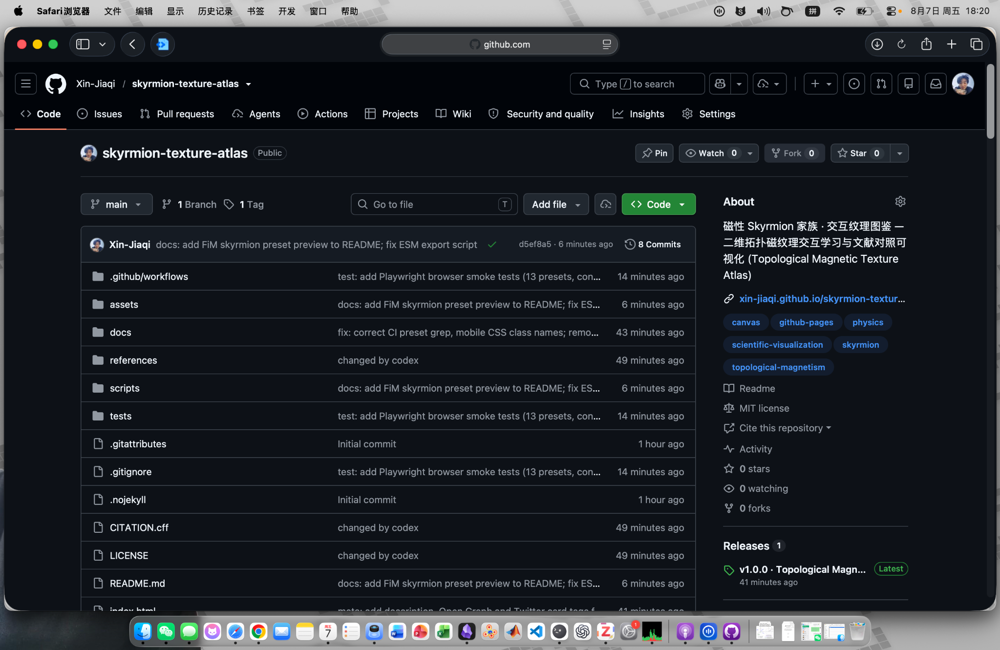
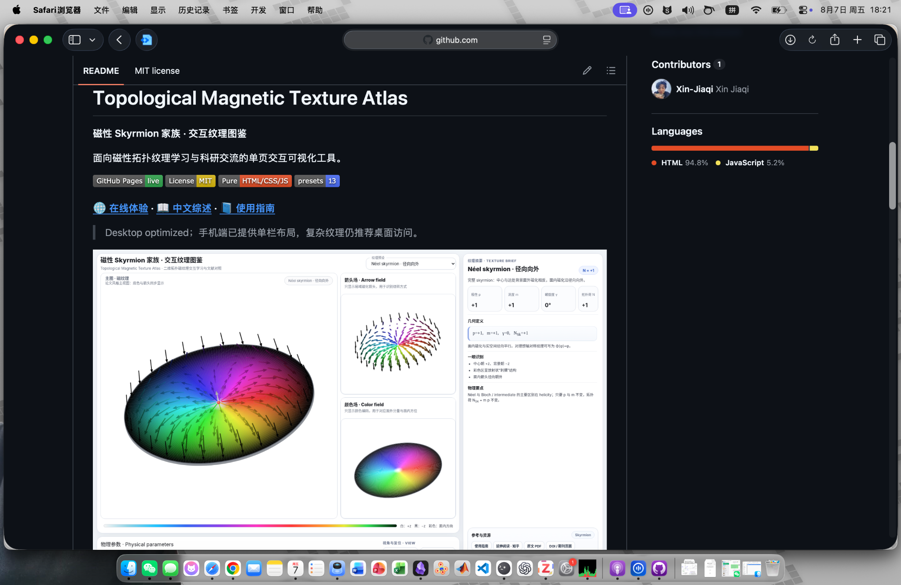
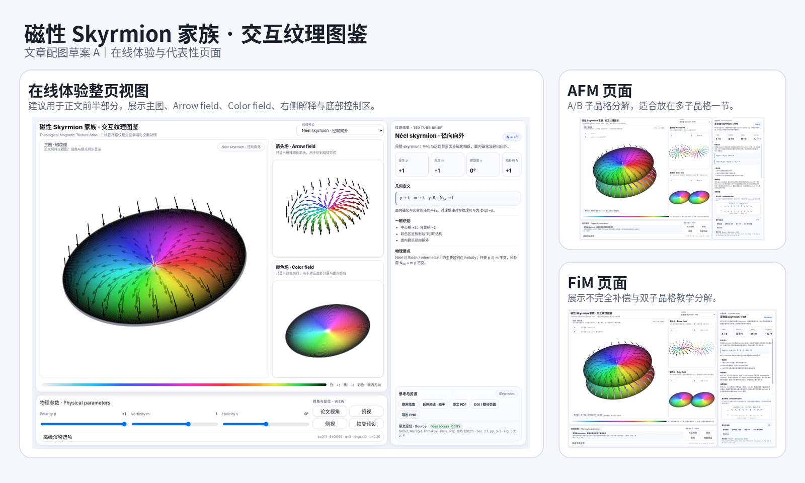
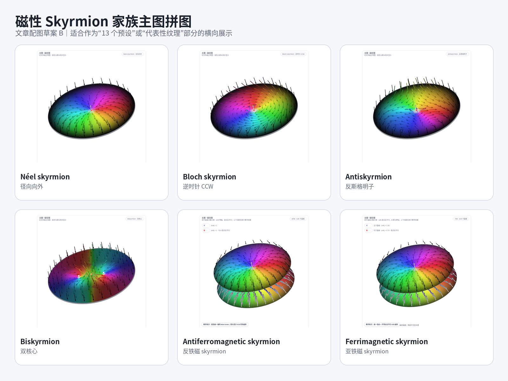
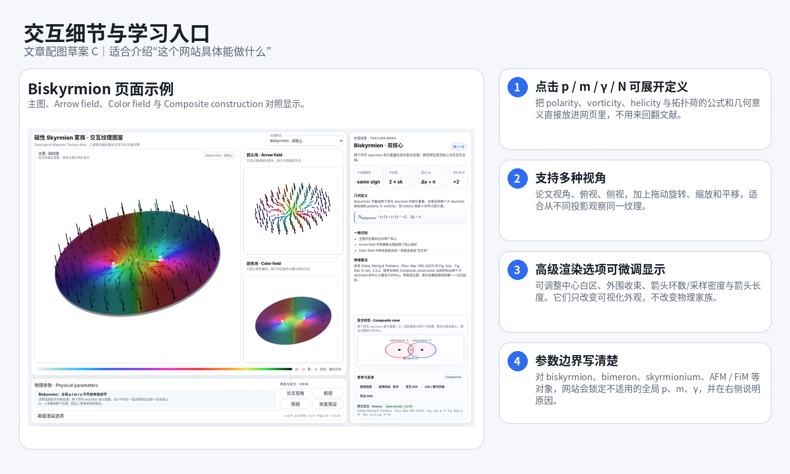
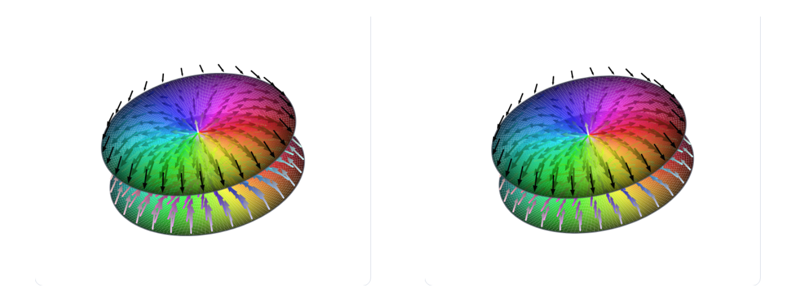
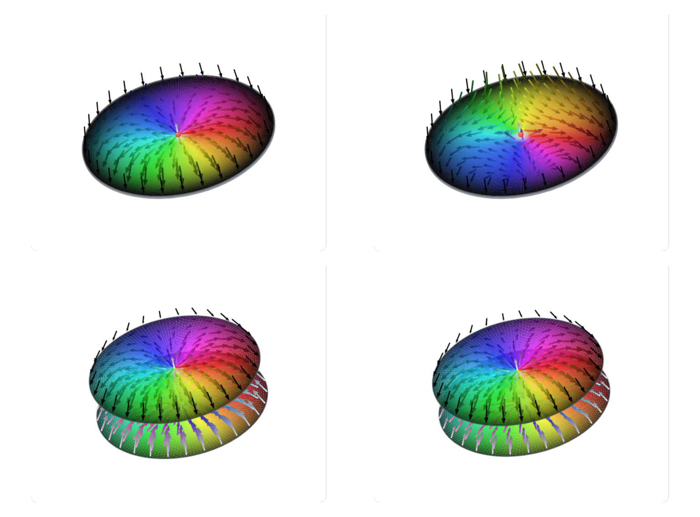
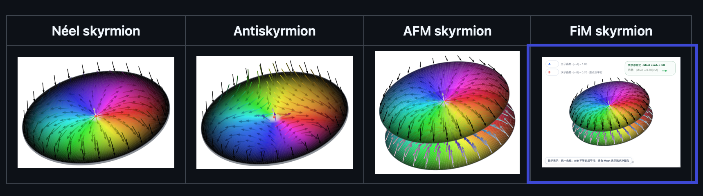
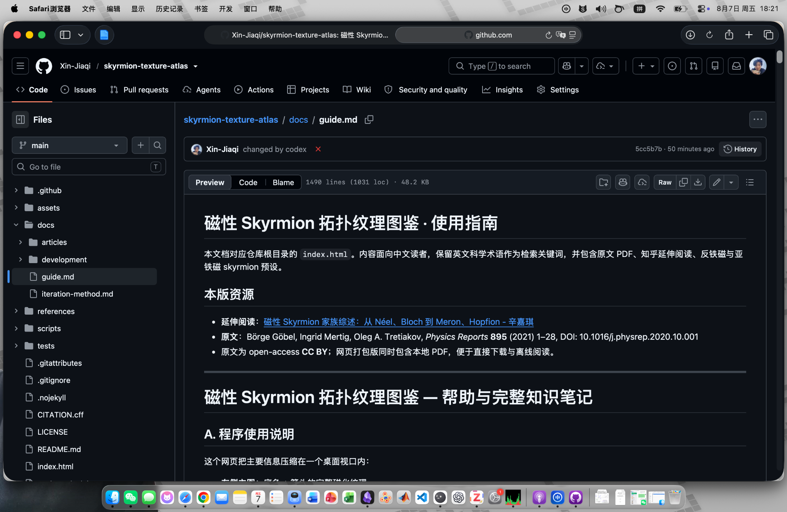
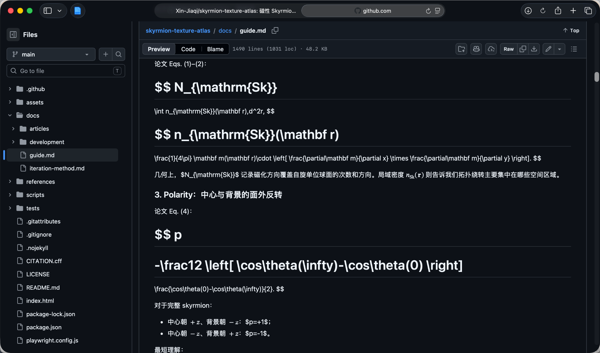

# 磁性 Skyrmion 交互纹理图鉴：带图完整版（适合 Obsidian / Markdown Nice）

> 这个文件是可直接导入 Obsidian 或 Markdown Nice 的**带图完整版**。图片都在同级 `images/` 文件夹内，使用相对路径引用。

# 我把 magnetic skyrmion 家族做成了一个可交互的在线纹理图鉴

前段时间重新整理 magnetic skyrmion 的综述时，我一直有个很强的感觉：Göbel、Mertig 和 Tretiakov 那篇 *Physics Reports* 里的 Fig. 2，几乎就是一张二维拓扑磁纹理的“地图”。Néel、Bloch、antiskyrmion、skyrmionium、biskyrmion、meron、bimeron，连反铁磁和亚铁磁 skyrmion，也都能放进同一套几何语言里来理解。

静态图片当然很有用，但真正开始学习时，很快就会遇到两个问题。第一，图和图之间切来切去，会让人很难建立连续直觉。第二，$p$、$m$、$\gamma$ 这些参数写成公式很简洁，落到一圈颜色和箭头以后，直觉并不总是跟得上。

所以我干脆把它做成了一个可以直接在浏览器里玩的交互网页：**磁性 Skyrmion 家族 · 交互纹理图鉴**。

GitHub：<https://github.com/Xin-Jiaqi/skyrmion-texture-atlas>

在线体验：<https://xin-jiaqi.github.io/skyrmion-texture-atlas/>

延伸中文综述：<https://zhuanlan.zhihu.com/p/2069027257536999823>

## GitHub 首页与 README 预览





上面两张图适合放在文章前部：第一张强调这是一个公开仓库，第二张强调它不仅能在线体验，还有 README、中文综述和使用指南等入口。

## 从三个参数重新看 skyrmion

对完整、近似轴对称的二维 skyrmion，可以把归一化磁化场写成

$$
\mathbf m(\mathbf r)=
\begin{pmatrix}
\sin\theta\cos\Phi\\
\sin\theta\sin\Phi\\
\cos\theta
\end{pmatrix}.
$$

这里 $\theta$ 决定面外分量，$\Phi$ 决定面内磁化方位。对理想轴对称纹理，一个很方便的写法是

$$
\Phi(\phi)=m\phi+\gamma.
$$

这样一来，三个最常用的量就会变得很直观。

- **polarity $p$**：比较中心和远处背景的面外方向；
- **vorticity $m$**：绕纹理中心一周时，面内磁化一共旋转几圈；
- **helicity $\gamma$**：面内箭头相对径向统一偏转多少。

对这类完整 skyrmion，常有

$$
N_{\mathrm{Sk}}=mp.
$$

网页里把 $p$、$m$、$\gamma$ 直接做成了交互参数。拖动 $\gamma$ 时，可以连续看到径向的 Néel 纹理逐步过渡到 Bloch，再继续进入中间态。这个过程比看三张分开的示意图更容易建立直觉。

## 在线体验：整页视图与代表性纹理





目前网页里放了 **13 个预设**，包括：Néel skyrmion、Bloch skyrmion、intermediate-helicity skyrmion、higher-order skyrmion、antiskyrmion、skyrmionium、biskyrmion、meron、bimeron、antiferromagnetic skyrmion、ferrimagnetic skyrmion。

网页会同步显示三种视图：

1. **主图**：完整磁纹理；
2. **Arrow field**：只保留箭头，专门看局域磁化方向；
3. **Color field**：只保留颜色，专门看面外分量与面内方位编码。

颜色规则始终保持统一：**白色表示 $+z$，黑色表示 $-z$，彩色表示面内方向。**

## 这个网站里一些我觉得很值得玩的细节



### 1. 视角切换不只是好看，而是帮助识别

网页里保留了 **论文视角、俯视、侧视** 三种快速视图，还支持拖动旋转、滚轮缩放和平移。

### 2. 点击 $p$、$m$、$\gamma$、$N_{\mathrm{Sk}}$，定义会直接弹出来

我把 polarity、vorticity、helicity 和 topological charge 的定义、公式和几何含义直接放到了网页里。读者不需要在“看图”和“翻文献”之间来回切换，点一下就能看到对应解释。

### 3. 高级渲染选项可以细抠图像外观

网页还留了一个 **高级渲染选项**。里面可以调节：中心白区大小、外围收束和边界过渡、箭头环数（采样密度）、箭头长度。

### 4. “恢复预设”会把物理参数和显示参数一起恢复

网页里的“恢复预设”并不是只把 $p$、$m$、$\gamma$ 拉回去，它会把高级渲染选项和默认论文视角也一并恢复。

### 5. 对不适合统一参数化的对象，程序会主动锁参数

biskyrmion、bimeron、skyrmionium，以及 AFM / FiM skyrmion，并不适合硬塞进一组简单的全局 $p$、$m$、$\gamma$ 里。网页对这些对象会把相关参数置灰锁定，同时在右侧写清楚“为什么不开放这几个参数”。

## 反铁磁与亚铁磁 skyrmion：建议使用修正版对照图

旧的四宫格图里，AFM / FiM 那两格容易出现两个问题：

1. 图片来源不统一，有的是主图导出，有的是页面截图，所以尺度会不一致；
2. FiM 如果直接拿页面截图缩小，细节很容易看不清。

下面这张是**统一主图来源、统一画布与版式**之后的修正版：



如果你还想保留“四宫格总览”这种版式，建议使用这张修正版：



作为对照，你之前那张有问题的原图我也一起放进来了，方便你回看：



## 使用指南与 GitHub 预览中的公式问题





上面最后一张图暴露了一个很典型的问题：**GitHub Preview 对数学公式的渲染并不总是可靠**，尤其当文档既要给 GitHub 看，又要给 Obsidian / Markdown Nice / 公众号使用时，很容易出现“一个地方好看，另一个地方炸掉”的情况。

我的建议是分两层处理：

- **面向 Obsidian / Markdown Nice / 公众号的主稿**：保留标准 LaTeX 公式；
- **面向 GitHub 网页预览的副稿**：对复杂公式改用 GitHub 更稳妥的写法，或加一版纯文本解释。

例如块公式可优先改成：

```math
N_{\mathrm{Sk}} = \int n_{\mathrm{Sk}}(\mathbf r)\, d^2 r
```

而不是完全依赖 `$$ ... $$` 在所有环境里都正常渲染。

## 中文综述视图

这里我先给你**预留位置**，因为你这次没有单独给我知乎长文首屏截图。你只需要把截图放进 `images/` 文件夹，然后把下面一行取消注释即可：

```markdown
<!--  -->
```

## 开源与使用

整个工具目前是纯 HTML / CSS / JavaScript 的静态网页，没有前端框架依赖。下载下来以后，直接打开 `index.html` 就可以离线运行。

这个形式对科研分享挺友好：

- 发给别人很轻；
- 部署到 GitHub Pages 也很方便；
- 课堂、组会、笔记、文章都可以直接复用；
- 既能在线交互，也能离线展示。

如果你正在学 skyrmion，我会很推荐把它和原论文 Fig. 2 对照着一起看。很多以前需要在几张静态图之间来回切换才能勉强建立的关系，现在会顺很多。
