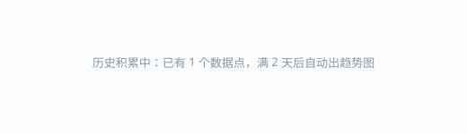

<!-- 知乎数据回流 · 由 05-data-backflow/src/build.py 自动生成，请勿手改 -->
## 知乎数据回流

实时展示本项目配套知乎内容的赞 / 藏 / 评论（数据源：知乎开放平台 Zhihu CLI）。

| 项目 / 页面 | 知乎内容 | 赞 | 藏 | 评 | 较昨日 |
|---|---|---|---|---|---|
| [磁性 Skyrmion 家族 · 交互纹理图鉴](https://xin-jiaqi.github.io/skyrmion-texture-atlas/) | [1 条](https://zhuanlan.zhihu.com/p/2069027257536999823) | 7 | 14 | 0 | — |

_更新于 2026-08-08 · 共 1 个项目 · 14 藏 / 7 赞 / 0 评 · 较昨日 —_
